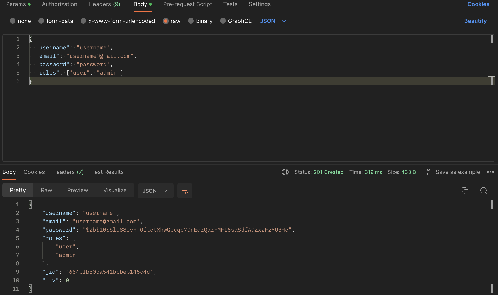
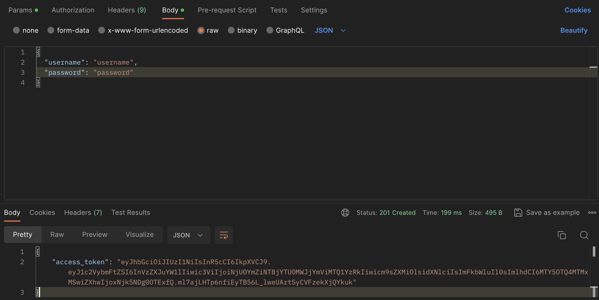
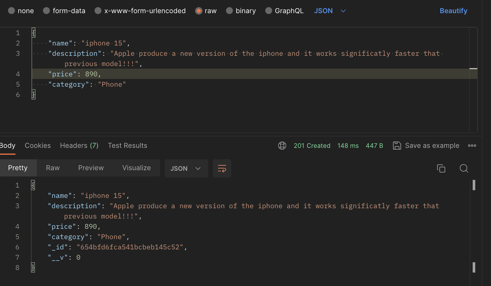

<p align="center">
  <a href="http://nestjs.com/" target="blank"></a>
</p>

[circleci-image]: https://img.shields.io/circleci/build/github/nestjs/nest/master?token=abc123def456
[circleci-url]: https://circleci.com/gh/nestjs/nest

  <p align="center">A progressive <a href="http://nodejs.org" target="_blank">Node.js</a> framework for building efficient and scalable server-side applications.</p>
    <p align="center">
<a href="https://www.npmjs.com/~nestjscore" target="_blank"></a>
<a href="https://www.npmjs.com/~nestjscore" target="_blank"></a>


## Description

[Nest](https://github.com/nestjs/nest) framework TypeScript starter repository.

## Installation

```bash
$ npm install
```

## Running the app

```bash
# development
$ npm run start

# watch mode
$ npm run start:dev
```

## Test

```bash
# unit tests
$ npm run test

# test coverage
$ npm run test:cov
```
## Some examples

### Create a new user

#### POST User: http://localhost:3000/auth/register

```
{
  "username": "username",
  "email": "username@gmail.com",
  "password": "password",
  "roles": ["user", "admin"]
}
```


#### POST login and Get token: http://localhost:3000/auth/login

```
{
  "username": "username",
  "email": "username@gmail.com",
  "password": "password",
  "roles": ["user", "admin"]
}
```



#### POST Create Product in : http://localhost:3000/auth/login

```
{
    "name": "iphone 15",
    "description": "Apple produce a new version of the iphone and it works significatly faster that previous model!!!",
    "price": 890,
    "category": "Phone"
}
```




## Support

Nest is an MIT-licensed open source project. It can grow thanks to the sponsors and support by the amazing backers. If you'd like to join them, please [read more here](https://docs.nestjs.com/support).

## License

Nest is [MIT licensed](LICENSE).
